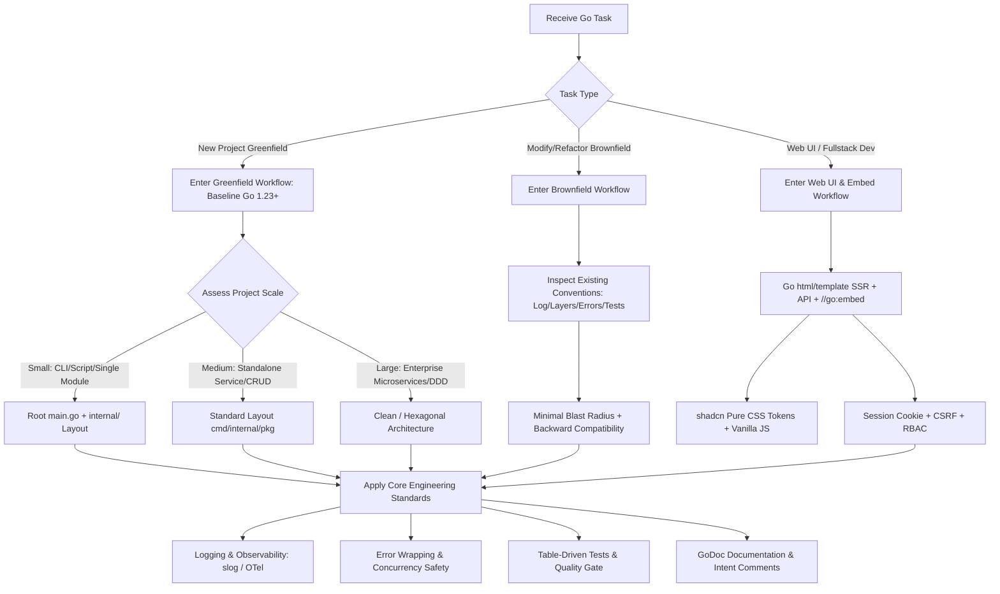

# Go Engineering and Code Specification Skill (Go LLM Specification)

This specification is designed specifically for Large Language Models (LLMs) to guide Go code generation, refactoring, code review, full-stack Web page development, and architectural design. It strictly adheres to official Go best practices (Effective Go, Go Code Review Comments, Uber Go Style Guide) and modern Go (Go 1.23+) standards.

---

## 1. Non-Negotiable Golden Rules

In any Go development task, the following golden rules must be followed unconditionally:

1. **Explicit Error Handling & Wrapping**:
   - Never ignore `error` values (except in rare cases explicitly permitted by standard library documentation; all others must be checked explicitly).
   - Returning errors up the call stack must use `fmt.Errorf("...: %w", err)` to preserve the root cause; checking error types must use `errors.Is` and `errors.As`. Never perform string matching on error text.
   - **Handle errors only once**: Either handle and log the error locally, or wrap and return it up the stack. Never "log and return" at the same time.
2. **Context Propagation**:
   - Any function involving I/O, RPC, database queries, network calls, long-running computations, or cancellable operations must accept `ctx context.Context` as its first parameter.
   - Never store a `context.Context` inside a struct field (except for rare standard library adapters like `http.Request`).
3. **No Leaking Goroutines (Lifecycle Closure)**:
   - Never launch an unmanaged "orphan" goroutine without a clear termination mechanism. Any background goroutine must be managed by listening to `context.Done()`, or tracked using `sync.WaitGroup` / `golang.org/x/sync/errgroup`.
4. **Accept Interfaces, Return Structs**:
   - Interfaces should be defined by the **consumer** on an as-needed basis and kept minimal (1–2 methods are best). Avoid pre-defining monolithic interfaces in producer/implementation packages.
5. **Consistency First in Brownfield Projects**:
   - When modifying existing codebases, **always detect and respect existing project conventions, layering, logging libraries, error handling patterns, and naming conventions**. Never introduce conflicting secondary standards into an established project.
6. **Modern Vanilla Web & Single Binary Delivery**:
   - When developing Web UI in Go, favor modern native Web standards (Vanilla JS/CSS/HTML5) and Go `html/template`. Align visual styling with **shadcn/ui** design tokens using pure modern CSS, without introducing heavy Node.js/Webpack build pipelines unless strictly necessary.
   - Templates and static assets must be bundled into a single binary executable using `//go:embed`.
   - Any session management or state-modifying requests must enforce `HttpOnly/Secure` cookies, CSRF protection, and security headers.
7. **Strict GoDoc Comments & Intent Explanation ("Explain Why")**:
   - All exported packages, types, functions, methods, constants, and variables must have complete-sentence GoDoc comments, and **the first sentence must begin with the identifier's name**.
   - Critical and core functions must provide usage examples in their doc comments.
   - Comments inside code blocks must focus on **explaining "why" (design intent, business context, concurrency invariants, or trade-offs)**, rather than redundantly stating "what" the code does.

---

## 2. Decision Routing Tree

Use this decision tree to quickly identify and apply the relevant specification module:

---

## 3. References Index

Refer to the detailed reference documents for in-depth guidelines:

| Module | Core Scope | Reference Path |
| :--- | :--- | :--- |
| **01. Scale & Project Layouts** | Small (Root main + internal/) / Medium (Standard Layout) / Large (Clean/DDD) architecture paradigms | [01_scale_and_structures.md](./references/01_scale_and_structures.md) |
| **02. Greenfield & Brownfield SOP** | Baseline Go 1.23+; greenfield scaffolding pipeline; brownfield codebase inspection, backward compatibility, option pattern, regression prevention | [02_greenfield_and_brownfield.md](./references/02_greenfield_and_brownfield.md) |
| **03. Logging & Observability** | `log/slog` structured logging, TraceID propagation, RED metrics, tracing boundaries (optional for small/medium), health probes | [03_logging_and_observability.md](./references/03_logging_and_observability.md) |
| **04. Testing & Quality Gates** | Table-driven tests, `testify` assertions, interface mocking philosophy, `-race` detector, fuzzing | [04_testing_and_quality.md](./references/04_testing_and_quality.md) |
| **05. Error Handling & Concurrency** | `%w` wrapping, `errors.Is/As`, custom app errors, `errgroup` concurrency orchestration, channel ownership | [05_errors_and_concurrency.md](./references/05_errors_and_concurrency.md) |
| **06. Idiomatic Go & Pitfalls** | Zero-value usefulness, functional options, memory/handle leak prevention, goroutine leak audits, acronym casing | [06_idiomatic_go_best_practices.md](./references/06_idiomatic_go_best_practices.md) |
| **07. Web UI & Single Binary Embed** | Modern Vanilla JS/CSS/HTML5, Go template (SSR) + API hybrid architecture, shadcn styling, `//go:embed` single binary, auth & CSRF | [07_web_ui_and_templating.md](./references/07_web_ui_and_templating.md) |
| **08. Code Comments & Documentation** | Official GoDoc standards, exported identifier comments (starting with name), critical function examples, explaining "why" vs "what" | [08_documentation_and_comments.md](./references/08_documentation_and_comments.md) |

### 3.1 Official Baseline & Fallbacks

For any edge cases, syntax debates, or architectural details not explicitly covered by this specification, **always fall back to official Go specifications and recognized community best practices**:

1. **[Effective Go](https://go.dev/doc/effective_go)**: The canonical guide to naming, control structures, initialization, interface design, and concurrency models.
2. **[Go Code Review Comments](https://go.dev/wiki/CodeReviewComments)**: Common review feedback collected by the Go core team (casing of acronyms, context passing, error strings, receiver types).
3. **[Go Doc Comments](https://go.dev/doc/comment)**: Official syntax and formatting standard for Go doc comments.
4. **[Uber Go Style Guide](https://github.com/uber-go/guide/blob/master/style.md)**: Battle-tested engineering style guide and pitfall mitigation.
5. **Go Standard Library Idioms**: When in doubt about abstraction design, consult the Go standard library packages (e.g., `net/http`, `io`, `os`, `sync`).

---

## 4. Templates & Configurations

- **Linter Config**: [golangci.yml](./templates/golangci.yml) (Production configuration with `gofumpt`, `govet`, `revive`, `staticcheck`, `errcheck`, etc.)
- **Build Makefile**: [Makefile](./templates/Makefile) (Standard targets for `tidy`, `fmt`, `vet`, `lint`, `test`, `race`, `cover`, `build`)
- **Table Test Template**: [standard_table_test.go](./templates/standard_table_test.go) (Parallel table-driven test skeleton with mock injection and assertions)
- **Web UI Templates**:
  - [shadcn_tokens.css](./templates/web/shadcn_tokens.css) (Zero-dependency pure modern CSS design system matching shadcn/ui)
  - [base_layout.html](./templates/web/base_layout.html) (Responsive HTML5 layout with Go `html/template`, dark mode flash-prevention, and unified Fetch client)
  - [embed_server.go](./templates/web/embed_server.go) (Production-ready single-binary Web server skeleton with `embed.FS`, CSRF, sessions, and security headers)

---

## 5. Pre-Commit / Pre-Delivery Checklist

Before delivering any Go code, perform this self-check:
- [ ] Development environment and `go.mod` baseline target Go 1.23+.
- [ ] `go vet ./...` and `golangci-lint run` pass with zero warnings.
- [ ] `go test -race ./...` passes completely with no data races or goroutine leaks.
- [ ] All errors from invoked functions are inspected and appropriately handled or wrapped.
- [ ] All exported structs, interfaces, functions, methods, and constants have complete GoDoc comments (first sentence begins with the identifier name).
- [ ] Critical business functions and core utilities include clear usage code examples in doc comments.
- [ ] Non-obvious code blocks (locks, buffered channels, defensive branches, workarounds) have comments explaining "why".
- [ ] Context (`ctx context.Context`) is propagated through all external I/O and long-running calls.
- [ ] (If Web UI is involved) Template variables are safely auto-escaped by `html/template` with no XSS vulnerabilities.
- [ ] (If Web UI is involved) Static assets and templates are embedded using `//go:embed` with appropriate caching headers.
- [ ] (If Web UI is involved) State-mutating requests validate CSRF tokens, and session cookies have `HttpOnly` and `SameSite=Lax`.
