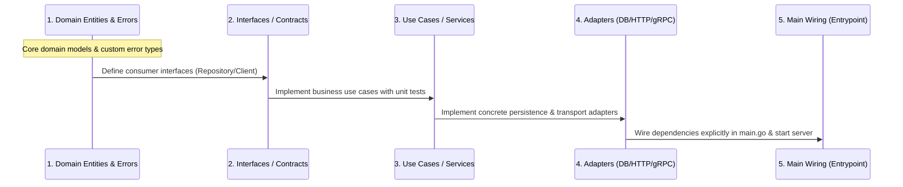

# 02. Greenfield & Brownfield Standard Operating Procedures (SOP)

---

## 1. Greenfield Scaffolding SOP

Construct new Go projects in stages following this sequence:

### Stage 1: Environment & Dependency Initialization
1. **Initialize Module & Set Version Baseline**:
   ```bash
   go mod init <module-path>
   # Target Go 1.23+ baseline
   ```
2. **Setup Core Toolchain**:
   - Add `.golangci.yml` (Static analysis baseline, see [golangci.yml](../templates/golangci.yml)).
   - Add `Makefile` (Standard targets for `test`, `race`, `lint`, `build`, see [Makefile](../templates/Makefile)).
   - Configure `.gitignore` (Ignore binaries, `.env`, coverage reports `.coverprofile`).

### Stage 2: Bottom-Up Scaffolding Pipeline
Generate code strictly from the bottom up to preserve dependency inversion:



### Stage 3: Server Startup & Graceful Shutdown (Production Template)
Inside `cmd/<app>/main.go`, always include production-grade graceful shutdown:

```go
package main

import (
	"context"
	"errors"
	"log/slog"
	"net/http"
	"os"
	"os/signal"
	"syscall"
	"time"
)

func main() {
	// 1. Initialize structured logging
	logger := slog.New(slog.NewJSONHandler(os.Stdout, &slog.HandlerOptions{
		Level: slog.LevelInfo,
	}))
	slog.SetDefault(logger)

	// 2. Initialize global lifecycle context listening for interrupt signals
	ctx, stop := signal.NotifyContext(context.Background(), os.Interrupt, syscall.SIGTERM)
	defer stop()

	// 3. Assemble application components (Manual Dependency Injection)
	srv := &http.Server{
		Addr:         ":8080",
		Handler:      buildRouter(),
		ReadTimeout:  5 * time.Second,
		WriteTimeout: 10 * time.Second,
		IdleTimeout:  120 * time.Second,
	}

	// 4. Launch server in background goroutine
	go func() {
		slog.Info("server is starting", "addr", srv.Addr)
		if err := srv.ListenAndServe(); err != nil && !errors.Is(err, http.ErrServerClosed) {
			slog.Error("server fatal error", "error", err)
			os.Exit(1)
		}
	}()

	// 5. Block until shutdown signal received
	<-ctx.Done()
	slog.Info("shutdown signal received, draining connections...")

	// 6. Graceful shutdown timeout control
	shutdownCtx, cancel := context.WithTimeout(context.Background(), 10*time.Second)
	defer cancel()

	if err := srv.Shutdown(shutdownCtx); err != nil {
		slog.Error("server forced to shutdown", "error", err)
	}
	slog.Info("server exited cleanly")
}

func buildRouter() http.Handler {
	mux := http.NewServeMux()
	mux.HandleFunc("GET /healthz/live", func(w http.ResponseWriter, r *http.Request) {
		w.WriteHeader(http.StatusOK)
		w.Write([]byte(`{"status":"UP"}`))
	})
	return mux
}
```

---

## 2. Brownfield Modification SOP

Core directives: **Consistency First, Minimal Blast Radius.**

### Step 1: Codebase Inspection (Inspect Before Writing Code)
Before writing any code, scan the codebase and identify conventions:
1. **Logging System Inspection**:
   - Check if the project uses `log/slog`, `uber-go/zap`, `rs/zerolog`, or standard `log`.
   - *Rule*: **Inherit the existing logging library**. Never introduce `slog` into a project using `zap`, nor introduce `zap` into a project using `slog`.
2. **Error Handling Pattern Inspection**:
   - Check if the project uses custom error structs, `pkg/errors`, or standard library `fmt.Errorf("%w")`.
3. **Architecture & Layering Inspection**:
   - Inspect directory layout (MVC, Standard Layout, DDD/Clean).
   - Find similar existing implementations (e.g., when adding an endpoint, review how existing endpoints structure their Handler/Service/Repo).
4. **Test Framework Inspection**:
   - Check if tests use `testify`, `ginkgo`, `gomock`, or pure standard `testing`.

### Step 2: Preserve Backward Compatibility
When adding parameters or functionality to existing functions/structs, **never break exported function signatures directly**. Use one of two backward-compatible approaches:

#### Approach A: Functional Options Pattern
Ideal for configuration, client setup, or complex constructors:

```go
// Existing constructor remains compatible
type Option func(*ClientConfig)

func WithTimeout(d time.Duration) Option {
	return func(c *ClientConfig) {
		c.Timeout = d
	}
}

func WithMaxRetries(retries int) Option {
	return func(c *ClientConfig) {
		c.MaxRetries = retries
	}
}

// Extended constructor supports variadic options
func NewClient(addr string, opts ...Option) *Client {
	cfg := &ClientConfig{
		Timeout:    5 * time.Second, // Preserves legacy default behavior
		MaxRetries: 3,
	}
	for _, opt := range opts {
		opt(cfg)
	}
	return &Client{addr: addr, cfg: cfg}
}
```

#### Approach B: Add Context-Aware or Extended Function Variant
If a function signature must be enhanced (e.g., adding `context.Context` to a legacy function):
```go
// Retain legacy function (delegates internally) and mark Deprecated
// Deprecated: Use DoSomethingWithContext instead.
func DoSomething(param string) error {
	return DoSomethingWithContext(context.Background(), param)
}

// Introduce modern function signature
func DoSomethingWithContext(ctx context.Context, param string) error {
	// Core implementation
	return nil
}
```

### Step 3: Regression Prevention Pipeline
After making changes, execute the following verification steps:
1. **Run existing unit tests**:
   ```bash
   go test -v -run <ModifiedPackageOrTestName> ./...
   ```
2. **Add table-driven tests for newly introduced logic**.
3. **Run race condition detector**:
   ```bash
   go test -race ./...
   ```
4. **Run linter**:
   ```bash
   golangci-lint run
   ```
